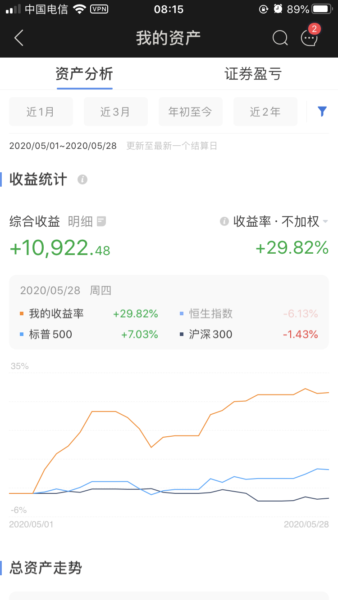

## 声明

*  

## 收益

* 4月份因整个市场较活跃，因此收益率有了大幅的提升，整个月收益如下。

  

## 仓位

* 本月的操作并不频繁，对其中一些股进行了调仓，目前的持仓为

|代码|持有数量|成本价|盈亏金额|备注|
|--- |---|---|---|---|
|AYX|60@106.00|135.92|-1795.21(-22.01%)|需要等待机会补仓、摊薄成本|
|ISRG|25@498.86|498.86|543.54|-1117.15(-8.22%)|
|PAYC|20@243.00|260.805|-356.1(-6.83%)|不做不仓及减仓操作|
|BILL|100@55.73|55.73|-202.4(-3.5%)|不做处理|
|CRM|15@156.30|157.62|-19.8(-0.84%)|不做处理|
|LMT|10@383.47|383.22|+2.5(+0.07%)|不做处理|
|DIS|40@105.60|103.07|+101.2(++2.45%)|不做处理|
|ASML|40@105.60|103.07|+101.2(+2.45%)|不做处理|
|NOW|5@339.00|194.82|+720.9(+74.01%)|不做处理|
|TSLA|34@706.50|396.3424|+10,545.36(+78.25%)|不做处理|
## 总结分析

* 本月操作的次数较多，既有做多，也有做空。利用日内浮动做t，培养盘感觉。
* TSLA在财报之前入手，财报后，没有按照策略对加仓的部分进行减仓获利，目前已把赢利回退，根据现有疫情状况，下个月可能还是震荡。需要关注。
* 本月新增了DIS、LMT的持有。
  * 持有DIS的基本逻辑是复工有望、Disney+的概念、现有股价处于一个较低的水平。
  * 持有LMT的基本逻辑是龙头股、三胖问题。该持有其实是有一定冒险的，一个主要原因是现在股价较高。
* 本月XLNX、VMW并没有操作，想当成长期持有，到年底在看情况。

