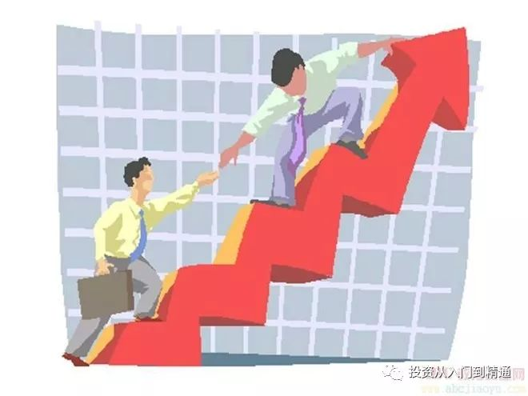
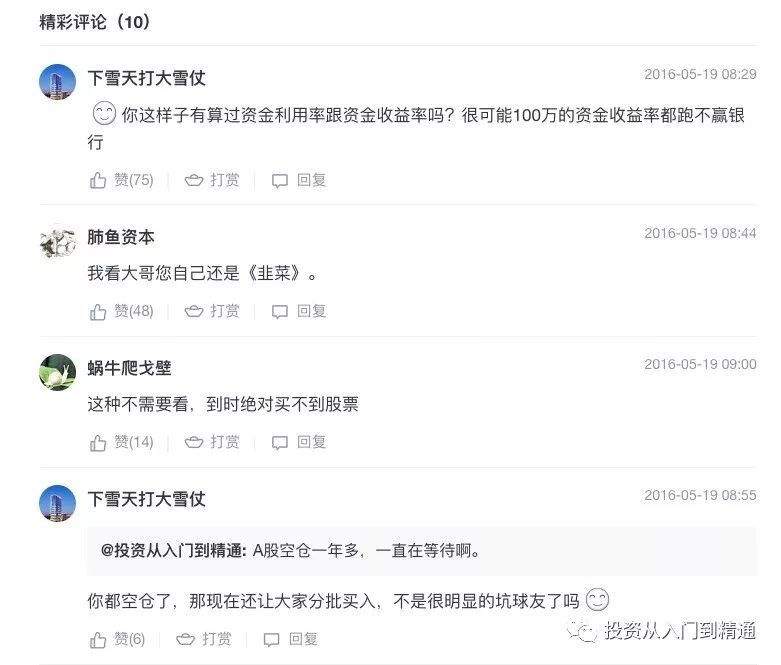
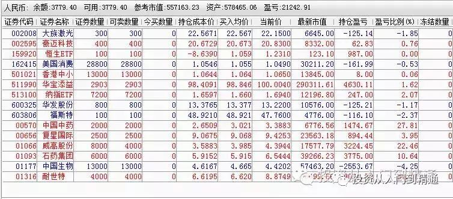

本文是把以前的6+1交易法再修正一遍，主要修正了三个问题，一个是加上了原创声明，第二是增加了追涨法，第三是增加了剩余现金说明。

  

许多股民的亏损，倒不是选了多么倒霉的股票，而是因为没有好的交易方法。我把长期实践中的“6+1”交易法公布出来，希望能够互通有无，共同进步。

**每次买1%，每下跌10%买一次，总共买6次，这样，用了6%的资金，股价差不多腰斩。**

**一半仓位做波段摊低成本，一半仓位当底仓做长线：**

需要记住，如果买入2次以上，第二次买入的仓位逢5-20%反弹就卖，这个幅度要看个股的活性，比如公用事业公司和互联网公司的活性就不同，要区别对待。速记的方法就是，建仓价格从上往下数，1、3、5层做底仓长期持有，（防止反弹卖空，涨起来扼腕叹息）2、4、6层做波段，摊低持仓成本。

用这个方法有以下优点：

1、交易方法非常简单，便于实行。

2、改变交易风格，分散配置15-30个股票，有利于心理稳定，不会因为某一个股的黑天鹅，造成系统的冲击。

3、因为一个股的持仓只有6%，会促使你不断的去发掘股票，提供学习动力。

4、如果做全球市场A股、美股、港股的配置，每个市场配置5-10个股票，则可以熨平周期。

5、通过波段交易不断摊低持仓成本，提高自己的信心和战斗力。

注：如果你资金量没有那么大，或者时间没有那么多，不想那么精细化操作，也可以用4+2交易法，就是总共买4次，每次买2%，每下跌15%买一次，这样，一个股票的上限配置就是8%。也可以用3+3交易法，就是总共买3次，每次买3%，每下跌20%买一次，这样，一个股票的上限配置就是9%。

以上文字，是我在雪球网2016年5月19日的原文，我一字不改，放到了这里。

当时的下面的回帖一边倒的是看不起这个交易方法。

但是连我自己都没有想到，从2016年5月发帖以来，到2018年初的当下，22个月历经风风雨雨，采用这个方法的账户，基本都实现了90%以上的收益。

有人说那是因为我选的英伟达牛逼。但是那些我接手的A股账户买不了英伟达，靠什么赚的呢？有人说靠海康威视、大族激光、隆基股份。那11月交给我的示范账户来的晚，这些牛股都高位震荡了，我又靠什么赚呢？好，你说靠中概互联。那1月份交给我的账户又靠什么赚呢？

这也是很多我的铁粉看到我的示范账户历经这次股灾，昨天莫名其妙创出来新高，他们很难理解的原因。

那些说我主要靠中概互联基金做了几个正确波段赚钱的人，还是停留在投资就是选牛股思维，看不到小胜的决定作用。就像大家都喜欢巴菲特，却很难理解彼得林奇的1500个持股一样。

有些我的粉丝认为我的选股很牛，认为好股要重仓，6+1交易法限制了我取得更大的胜利。

那是因为他们在用后视镜看我的选股，所以产生了错觉。

其实两年来，我筛选了800个股票，买入交易了80多个股票，跑出来十多个牛股吧。选牛股的本事并不高。

很多人如果能够瞎买800个热门股，我相信他们选中的牛股概率比我还要高。

但是一个人曾经买过多少个大牛股，跟他能赚到大钱，完全没有关系。因为他们留不住牛股。

恰恰相反，我的6+1交易系统，具有优胜劣汰机制，所以长期筛选的结果，是持仓的牛股比例越来越高，这给了观察者一个错觉，以为我的选股能力很强。

其实他们没有看到6+1交易法超高的淘汰率。

以2016年10月的公众号实盘晒图为例。

[50万实盘账户示范（第1月）](http://mp.weixin.qq.com/s?__biz=MzI4OTE2NzYyOA==&mid=2655118612&idx=1&sn=2511d1c4e5a57593565a4ddccefd3070&chksm=f7860577c0f18c61006983713b215628f9ac087ada472ff22738bc4a8774258dfa1d06336432&scene=21#wechat_redirect)（打不开链接请前往我的同名公众号）

从2016年10月到现在，这个账户14个股票，只有大族激光和石药集团、中国生物制药、耐世特经过残酷的竞争留下来了，剩下的10个股票都被淘汰了。

一年半，这个系统的淘汰率是70%。

这个账户的主人是我大姨，她2017年10月取款15万去装修，现在市值95万，相当于从57.8万，一年半赚到110万，收益90%，注意，它没有买英伟达。它也不是靠哪一个大牛股实现的高收益。

其实我选股，并没有很多人想象的那么牛，只不过6+1交易法，可以把牛股养大。

6+1交易法有四个核心优势，1、单次选股概率高、2、累积概率高、3、容错率高，4、容量大。

有人觉得我选股厉害，其实就是把我的累积概率和初次选股概率混为一谈了。他没有看到，概率是可以累积的，牛股，是可以通过持股，通过日积月累筛选出来的。

这个筛选过程也很简单，优胜劣汰，业绩好的留下来，业绩差的在财报公布之后剔除。

容错率是啥意思呢？假如一个股票，连续涨了10个月，已经累积了很高的盈利，但是可能仅仅下跌一两个月，很多人就会卖掉它。这就是容错率很差的表现。这就像扔硬币，连续扔出来10次正面是好彩头，但是连续扔出来7次正面，再扔出来2次反面，再扔出来一次正面，依旧是很好的结果，但是很多人的系统就把这样的股票无情的淘汰了。

以腾讯为例，腾讯是有容错机制的，可以容许张小龙在研发微信前数年的静默期。

很多人看到我选的大族激光很牛，又有谁看到大族激光在我的持仓中半年的静默期？

另外一个容易困惑的地方是，很多人瞧不起我的1%交易法，认为好股要多买点。其实如果每一个股多买点的后果是很严重的，它会造成你的跑马场的容量变小。每个股票买1%，可以同时容纳100匹马比赛的话，如果你把仓位提高到每个股票百分之10，一个马场可能只能跑10几匹马了。那样的话，很多未来之星，在早期阶段，可能根本就没有机会纳入你的股票池，但是等它慢慢的隐蔽的涨起来之后，你又只能仰视，无法重现那个起点的赔率了。

最肥美的阶段其实是要买的早，持股坚定的诀窍，关键在成本低。

以我最近买的这一批股票为例，总共11个新股票，基本取自2017年11月份以来“百日为新”活动的研究成果，历经股灾，最终跑出来的明星股欧派家居，截止目前，逆市场大跌暴涨35%。我买之前在这11个股票里面，特别看好欧派家居吗？不是的。抄我作业的挑挑拣拣，选中了欧派家居吗？没有，很多人一次买仓位太多，不可能全部照抄11个股票，只能选自己特别中意的一两个股票买，不出所料，他们继踏空了大族激光、海康威视、隆基股份、华夏幸福、北新建材、先导智能、金禾实业之后，继续踏空了欧派家居。

这也是很多人抄我作业，只能挑着抄部分股票的原因，往往抄着抄着，就掉队了，最核心的原因，就是他们系统的容量不够。

很多人说，我要买10倍股，100倍股。请问，你的系统，能不能容纳10倍股？你的心胸，能不能容纳100倍股？

很多人问我，6+1交易法怎么追高，我在这里也解释一下：

最重要的原则是，用peg法追涨，peg降低了，可以追涨，每次追涨1%仓位。

追涨的话，还要拉开价格距离。比如10元底仓，追涨要等到18元，下一次追涨可能要到30元。如果频繁追涨，底仓的价格优势就没有意义了。

一般来说，追涨之后，经过修正的成本价要比现价便宜30%到50%。

每一个追涨的价格上下30%区间，只能追涨一次。这是为了防止成本提升的太快，假如说10元的底仓，20元追涨，那么成本可能就到14元了，如果跌到18你再追涨一两次，成本价可能就到16了，距离最新价18元就太近了，股价再跌就很容易损失全部的利润，造成心态崩溃。

所以，6+1交易法，不论是暴跌，还是暴涨之后追涨，都要保持一定的安全距离。下跌可以容许跌50%，上涨追高也可以容许回撤30%不产生亏损。

最后一个问题，很多人问，“假如我有100万，如果按照6+1，每次买1%，才花了一万元，那剩下的99万怎么办？”

我有一个示范账户，就是演示怎么从0仓位开始，一步步的怎么按照1%的节奏，把一个账户慢慢买满。

我用了3个月的时间，买入了18个股票，再加上可转债配置了13%的仓位，基金5%的仓位，剩下的三分之二的现金仓位，都买了货币基金511990华宝添益。

这些60%多的货币基金仓位储备，我打算用定投的方法，一个星期买入一两个股票，如果没有股市大跌加速定投的进程，大约需要一年的时间满仓股票。

我以前的经验是，把一个账户从全现金，用6+1交易法买成满仓股票，大约需要一年半到两年的时间。

今天讲的，就是“6+1交易法的跑马场选牛股策略”。